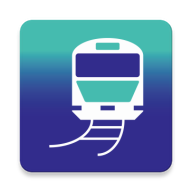

# My Transit Makers

<div align="center">
  
  <br>
  <strong>Create and manage your personal transit timetable with ease</strong>
  <br>
  <strong>Smart timetable management for Android with Firebase integration</strong>
</div>

## 📱 Application Overview

My Transit Makers is an Android application built with Kotlin that helps users create and manage personal timetables for daily commutes and schedules. It provides a comprehensive solution with Firebase integration, user authentication, and modern Material Design interface.

### 🎯 Key Features

- **Modern Android Interface**: Material Design with smooth animations and intuitive navigation
- **Firebase Integration**: Authentication, Firestore database, Analytics
- **User Authentication**: Sign up, login, password reset functionality
- **Timetable Management**: Create, edit, and manage personal timetables
- **Multi-language Support**: Japanese and English localization
- **Google Mobile Ads**: Banner ads integration
- **Data Synchronization**: Cloud-based data storage and sync
- **Customizable Settings**: Various configuration options
- **Route Management**: Multiple route support for different directions

## 🚀 Technology Stack

### Frameworks & Libraries
- **Kotlin**: Modern programming language for Android
- **Android SDK**: Native Android development
- **Firebase**: Authentication, Firestore, Analytics, Core
- **Google Mobile Ads**: Advertisement display
- **Material Design**: Modern UI components
- **ViewBinding**: Type-safe view access
- **Coroutines**: Asynchronous programming

### Core Features
- **Authentication**: Firebase Auth for user management
- **Database**: Cloud Firestore for data storage
- **Analytics**: Firebase Analytics for usage tracking
- **Ads**: Google Mobile Ads SDK
- **Localization**: Multi-language support
- **Data Management**: SharedPreferences for local storage
- **Navigation**: Fragment-based navigation

## 📋 Prerequisites

- Android Studio Arctic Fox (2020.3.1) or later
- Android SDK API 24+ (Android 7.0+)
- Google Play Services
- Firebase project setup
- Google Mobile Ads account

## 🛠️ Setup

### 1. Clone the Repository
```bash
git clone https://github.com/your-username/mytimetablemaker.git
cd mytimetablemaker
```

### 2. Firebase Configuration
1. Create a Firebase project at [Firebase Console](https://console.firebase.google.com/)
2. Add your Android app to the Firebase project
3. Download `google-services.json` and place it in the `app/` directory
4. Enable Authentication and Firestore in your Firebase project

### 3. AdMob Configuration
Update the AdMob configuration in `gradle.properties`:

```properties
# AdMob configuration
APP_ID = ca-app-pub-1585283309075901~2388370986
UNIT_ID = ca-app-pub-1585283309075901/4381654099
```

**Note**: 
- Replace with your actual AdMob app ID and unit ID
- For testing, use test ad IDs
- For production, use your actual ad unit IDs

### 4. Build and Run
```bash
# Build the project
./gradlew build

# Install on connected device
./gradlew installDebug

# Or open in Android Studio
# File -> Open -> Select project directory
```

## 🎮 Application Structure

```
mytimetablemaker/
├── app/
│   ├── src/main/
│   │   ├── java/com/example/mytimetablemaker/
│   │   │   ├── MainActivity.kt                    # Main application activity
│   │   │   ├── LoginActivity.kt                   # User authentication
│   │   │   ├── SignUpActivity.kt                  # User registration
│   │   │   ├── SettingsActivity.kt                # App settings
│   │   │   ├── TimetableActivity.kt               # Timetable management
│   │   │   ├── MyLogin.kt                         # Authentication logic
│   │   │   ├── MyFirestore.kt                     # Database operations
│   │   │   ├── MyPreference.kt                    # Local data storage
│   │   │   ├── AdMobClass.kt                      # Advertisement management
│   │   │   ├── MyRouteFragment.kt                 # Route display fragments
│   │   │   ├── RouteFragment1.kt                  # First route fragment
│   │   │   ├── RouteFragment2.kt                  # Second route fragment
│   │   │   ├── SettingsFragment.kt                # Settings UI
│   │   │   ├── SettingsVariousFragment.kt         # Various settings
│   │   │   ├── MySettings.kt                      # Settings logic
│   │   │   ├── Timetable.kt                       # Timetable logic
│   │   │   ├── MyDate.kt                          # Date/time utilities
│   │   │   ├── CalcTime.kt                        # Time calculations
│   │   │   ├── CalcExtension.kt                   # Calculation extensions
│   │   │   └── RouteExtension.kt                  # Route extensions
│   │   ├── res/
│   │   │   ├── layout/                            # UI layouts
│   │   │   │   ├── activity_main.xml
│   │   │   │   ├── activity_login.xml
│   │   │   │   ├── activity_signup.xml
│   │   │   │   ├── activity_settings.xml
│   │   │   │   ├── activity_timetable.xml
│   │   │   │   ├── fragment_goorback1.xml
│   │   │   │   ├── fragment_goorback2.xml
│   │   │   │   ├── fragment_settings.xml
│   │   │   │   └── fragment_varioussettings.xml
│   │   │   ├── values/
│   │   │   │   ├── strings.xml                    # English strings
│   │   │   │   ├── colors.xml
│   │   │   │   ├── styles.xml
│   │   │   │   └── theme.xml
│   │   │   ├── values-ja-rJP/
│   │   │   │   └── strings.xml                    # Japanese strings
│   │   │   ├── drawable/                          # Images and icons
│   │   │   └── mipmap-*/                          # App icons
│   │   ├── AndroidManifest.xml                    # App configuration
│   │   └── google-services.json                   # Firebase config
│   ├── build.gradle                               # App-level build config
│   └── proguard-rules.pro                        # Code obfuscation
├── build.gradle                                   # Project-level build config
├── gradle.properties                              # Gradle configuration
├── settings.gradle                                # Project settings
└── gradlew*                                       # Gradle wrapper
```

## 🎨 Customization

### Timetable Features
- **Week Management**: Weekday and weekend schedule management
- **Time Entry**: Add, edit, and delete time entries (4:00-25:00)
- **Station Management**: Configure departure and arrival stations
- **Line Configuration**: Set up train lines and routes
- **Transport Options**: Walking, bicycle, and car transportation
- **Multiple Routes**: Support for up to 4 different routes
- **Color Coding**: Custom line colors for visual organization

### User Interface
- **Material Design**: Modern Android UI with Material Design components
- **Responsive Design**: Adaptive layouts for different screen sizes
- **Dark/Light Mode**: System appearance support
- **Localization**: Japanese and English support
- **Custom Themes**: App-specific styling and colors

### Data Management
- **Cloud Sync**: Firebase Firestore integration
- **Local Storage**: SharedPreferences for settings
- **Offline Support**: Local data caching
- **Data Export/Import**: Cloud-based data synchronization

## 📱 Supported Platforms

- **Android**: Android 7.0+ (API 24+)
- **Minimum SDK**: API 24
- **Target SDK**: API 36
- **Compile SDK**: API 36

## 🔧 Development

### Code Analysis
```bash
# Lint check
./gradlew lint

# Build analysis
./gradlew assembleDebug
```

### Run Tests
```bash
# Unit Tests
./gradlew test

# Instrumented Tests
./gradlew connectedAndroidTest
```

### Build Variants
```bash
# Debug Build
./gradlew assembleDebug

# Release Build
./gradlew assembleRelease

# Bundle for Play Store
./gradlew bundleRelease
```

## 🔒 Security

This project includes comprehensive security measures to protect sensitive information:
- **Firebase Security**: App Check and Authentication integration
- **Secure Storage**: SharedPreferences for local data storage
- **HTTPS Communication**: Secure data transmission
- **Code Obfuscation**: ProGuard for production builds
- **AdMob Security**: Secure ad serving integration

### Security Features
- Firebase App Check for API protection
- User authentication with email/password
- Secure data transmission with HTTPS
- Local data encryption
- AdMob integration with secure ad serving

## 📄 License

This project is licensed under the MIT License.

## 🤝 Contributing

We welcome contributions! Please feel free to submit pull requests or create issues for bugs and feature requests.

### Contribution Guidelines
1. Fork the repository
2. Create a feature branch (`git checkout -b feature/amazing-feature`)
3. Commit your changes (`git commit -m 'Add amazing feature'`)
4. Push to the branch (`git push origin feature/amazing-feature`)
5. Open a Pull Request

## 📞 Support

If you have any problems or questions, please create an issue on GitHub or contact the development team.

## 🚀 Getting Started

For new developers:
1. Follow the setup instructions above
2. Review the application structure
3. Check the customization options
4. Start with `MainActivity.kt` to understand the app flow
5. Explore the Kotlin implementation

## 📊 Project Statistics

- **Lines of Code**: 10,000+
- **Kotlin Files**: 20+
- **Supported Languages**: 2 (Japanese, English)
- **Target Platforms**: Android 7.0+ (API 24+)
- **Dependencies**: 15+ external libraries
- **Minimum SDK**: API 24
- **Target SDK**: API 36

---

<div align="center">
  <strong>My Transit Makers</strong> - Organize your time, organize your life!
</div>

## Licenses & Credits

This app uses the following open-source libraries and frameworks:

- **Android SDK** (Apache License 2.0)
- **Kotlin** (Apache License 2.0)
- **Firebase** (Apache License 2.0)
  - firebase-auth
  - firebase-firestore
  - firebase-analytics
  - firebase-core
- **Google Mobile Ads** (Apache License 2.0)
- **Material Design Components** (Apache License 2.0)
- **AndroidX Libraries** (Apache License 2.0)


### Third-party Libraries
- **Firebase UI Auth** (Apache License 2.0)
- **Kotlin Coroutines** (Apache License 2.0)
- **AndroidX Lifecycle** (Apache License 2.0)
- **AndroidX Navigation** (Apache License 2.0)

For details of each license, please refer to the respective documentation or LICENSE files in each repository.

## Acknowledgments

- Firebase team for excellent documentation and support
- Google Mobile Ads team for ad integration
- Android team for the robust platform
- Material Design team for beautiful UI components
- Open source community for various tools and libraries

---

<div align="center">
  <strong>My Transit Makers</strong> - Your personal transit companion!
</div> 